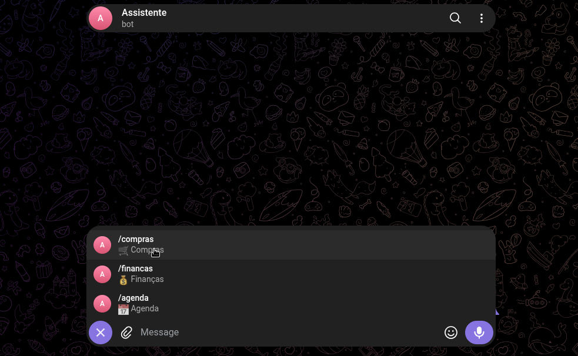
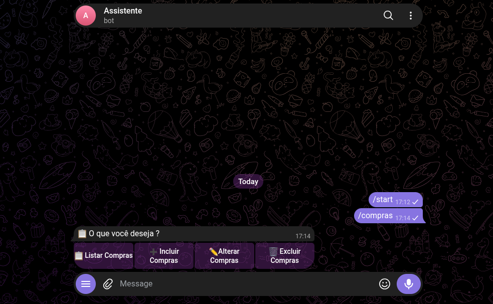
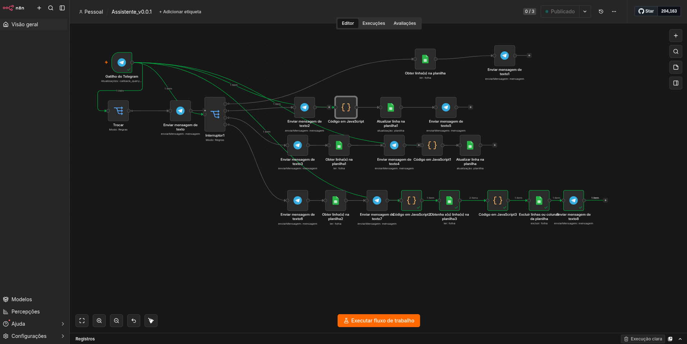

# 🤖 Automação Telegram com n8n

Projeto de automação desenvolvido com **n8n**, integrado ao **Telegram** e **Google Sheets**, permitindo realizar operações através de um bot com menus e botões interativos.

O projeto demonstra na prática a criação de workflows, integração com APIs, utilização de Webhooks e automação de processos.



---

## 🚀 Funcionalidades

* 🤖 Integração com Telegram Bot
* 🔗 Recebimento de eventos através de Webhook
* 📋 Listagem de registros
* ➕ Inclusão de registros
* ✏️ Alteração de registros
* 🗑️ Exclusão de registros
* 🔘 Menus e botões interativos
* 📊 Integração com Google Sheets
* 🔄 Processamento automático dos dados
* 💬 Retorno das operações diretamente no Telegram



---

## 🏗️ Arquitetura

```text
┌──────────────┐
│   Telegram   │
│     Bot      │
└──────┬───────┘
       │
       │ HTTPS
       ▼
┌──────────────┐
│  Cloudflare  │
│    Tunnel    │
└──────┬───────┘
       │
       ▼
┌──────────────┐
│     n8n      │
│    Docker    │
│    Local     │
└──────┬───────┘
       │
       ▼
┌──────────────┐
│ Google Sheets│
└──────────────┘
```

---

## 🛠️ Tecnologias utilizadas

| Tecnologia            | Utilização                              |
| --------------------- | --------------------------------------- |
| **n8n**               | Criação e execução dos workflows        |
| **Docker**            | Execução local do n8n                   |
| **Docker Compose**    | Gerenciamento do ambiente do n8n        |
| **Telegram Bot API**  | Comunicação com o bot                   |
| **Webhook**           | Recebimento dos eventos do Telegram     |
| **Cloudflare Tunnel** | Exposição do n8n local através de HTTPS |
| **Google Sheets API** | Armazenamento e manipulação dos dados   |
| **Git / GitHub**      | Versionamento e documentação            |

---

## 🔗 Webhook

O **n8n é executado localmente através do Docker**.

Como o Telegram precisa acessar o Webhook através da internet, foi utilizado o **Cloudflare Tunnel** para criar uma conexão entre uma URL pública HTTPS e o n8n executado localmente.

### Fluxo do Webhook

```text
Telegram
   │
   │ Requisição HTTPS
   ▼
Cloudflare Tunnel
   │
   │ Encaminhamento
   ▼
n8n local
   │
   ▼
Webhook
   │
   ▼
Workflow
```

---

## 🐳 Ambiente de execução

O n8n é executado localmente utilizando **Docker Compose**.

```text
Docker
   │
   └── n8n
       │
       ├── Workflows
       ├── Webhooks
       └── Integrações
```

O **Cloudflare Tunnel** é utilizado para disponibilizar o Webhook externamente.



---

## 📱 Funcionamento

A interação começa no Telegram.

O usuário acessa o menu do bot e seleciona a operação desejada.

```text
Usuário
   ↓
Telegram
   ↓
Webhook
   ↓
n8n
   ↓
Menu
   ↓
┌──────────────┐
│ ➕ Incluir   │
│ ✏️ Alterar   │
│ 🗑️ Excluir  │
│ 📋 Listar    │
└──────────────┘
   ↓
Processamento
   ↓
Google Sheets
   ↓
Resultado
   ↓
Telegram
```

---

## 📋 Operações disponíveis

### ➕ Incluir

Permite adicionar um novo registro através do Telegram.

### ✏️ Alterar

Permite localizar um registro e atualizar suas informações.

### 🗑️ Excluir

Permite selecionar um registro e realizar sua exclusão.

### 📋 Listar

Permite consultar os registros armazenados e apresentar os resultados no Telegram.

---

## 🔐 Segurança

As credenciais utilizadas no projeto não são disponibilizadas neste repositório.


---

## 🎯 Objetivo do projeto

Este projeto tem como objetivo demonstrar conhecimentos práticos em:

* N8N
* Criação de workflows
* Webhooks
* APIs
* Integração entre sistemas
* Docker
* Docker Compose
* Telegram Bot
* Google Sheets
* Git e GitHub

---

## 👨‍💻 Autor

**Fabiano Hipolito**

Projeto desenvolvido para portfólio e demonstração prática de conhecimentos em **automação com n8n, APIs, Docker e integração de sistemas **.
